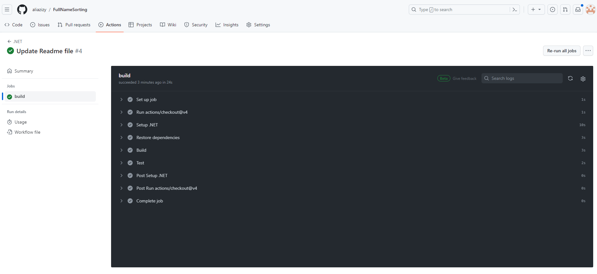

# Name Sorting

The Goal: Name Sorter
Given a set of names, order that set first by last name, then by any given names the person may have. 
A name must have at least 1 given name and may have up to 3 given names.

**Example Usage**

Given a file unsorted-names-list.txt containing the following list of names:
>Janet Parsons 
>Vaugh Lewis 
>Adonis Julius Archer 
>Shelby Nathan Yoder 
>Marin Alvarez 
>London Lindsey 
>Beau Tristan Bentley 
>Leo Gardner 
>Hunter Uriah Mathew Clarke 
>Mikayla Lopez 
>Frankie Conner Ritter 

Executing the program in the following way:
_name-sorter ./unsorted-names-list.txt_

Should result the sorted names to screen:

>Marin Alvarez 
>Adonis Julius Archer 
>Beau Tristan Bentley 
>Hunter Uriah Mathew Clarke 
>Leo Gardner 
>Vaughn Lewis 
>London Lindsey 
>Mikayla Lopez 
>Janet Parsons 
>Frankie Conner Ritter 
>Shelby Nathan Yoder 

The program should also write the sorted names to a file called sorted-names-list.txt.

## CI/CD Pipeline
Using GitHub actions, a continuous integration (CI) workflow(Pipeline) has been added to build and run tests which could be found  [here](https://github.com/aliazizy/FullNameSorting/actions "here"). 
For example: 

